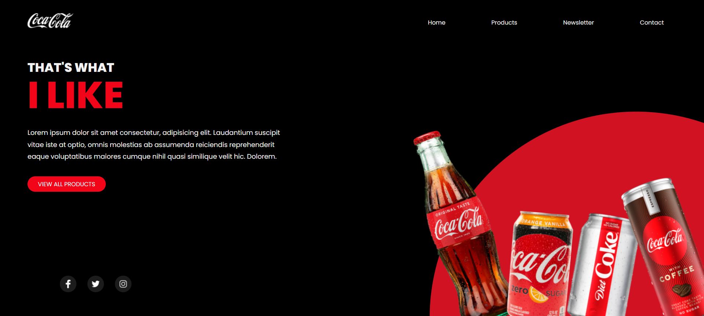

# Coca-Cola Inspired Landing Page

This project is a responsive landing page inspired by Coca-Cola's branding and style. The layout is simple yet visually striking, using a red, black, and white color scheme to evoke the brand's identity.



## Installation

To view this landing page locally:

1. Clone the repository to your local machine:
   ```bash
   git clone https://github.com/belacartaxo/landing-page-cocacola.git
2. Navigate to the project directory:
    ```bash
    cd landing-page-cocacola
3. Open the index.html file in your preferred web browser.

## Usage
Open the index.html file in a web browser to view the landing page. The page is fully responsive, adapting to different screen sizes and devices.

## Features
- Responsive Design: The layout adjusts to fit various screen sizes, ensuring the page looks great on mobile, tablet, and desktop devices.
- Thematic Design: Inspired by Coca-Cola, the page uses bold colors and imagery to capture the brand’s essence.

## Author
This repository is maintained by Your [Isabela Cartaxo](https://github.com/belacartaxo).
